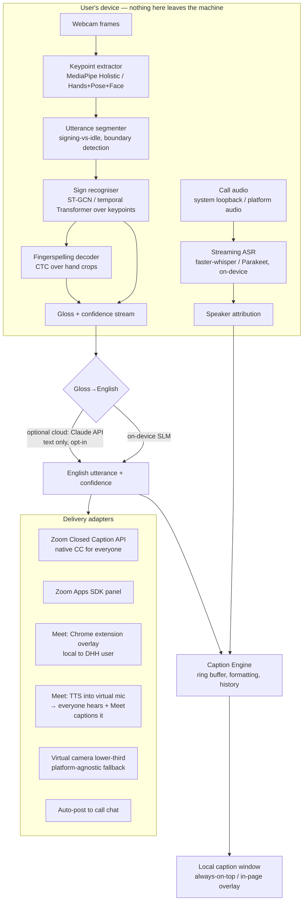

# Sign Language Buddy — Real-Time Two-Way Captioning for Video Calls

**Status:** Planning draft v1
**Date:** 2026-07-27
**Owner:** prashlkam@gmail.com

---

## 0. What this is, and an honest framing up front

**Product:** A webcam-based system that gives a Deaf or Hard-of-Hearing (DHH) participant a two-way
communication channel in Zoom and Google Meet without a human interpreter on the call:

- **Direction A — Sign → Text:** the DHH user signs (ASL or BSL) to their webcam; the system
  recognises it and delivers English text to the *hearing* participants (as native closed captions,
  synthesised speech, or an overlay).
- **Direction B — Speech → Text:** everyone else's audio is transcribed and rendered as low-latency,
  readable captions in front of the DHH user, with speaker attribution.

**Read this before committing to the roadmap.** Direction B is a solved engineering problem —
streaming ASR is commodity, and the hard parts are latency, diarisation and typography. Direction A
is *not* solved. Continuous, signer-independent, open-vocabulary sign language translation is an open
research problem: published BLEU-4 scores on continuous ASL translation benchmarks are in the low
single digits to low teens, which is nowhere near "trust this in a job interview." Systems that claim
otherwise are usually doing isolated-sign classification over a small vocabulary and presenting it as
translation.

Therefore this plan deliberately:

1. **Ships Direction B first** (weeks, not months) so the product is useful on day one.
2. **Scopes Direction A to what actually works today** — a bounded vocabulary of high-frequency
   meeting signs, plus fingerspelling, plus an LLM that assembles recognised glosses into English —
   and surfaces confidence honestly rather than hallucinating fluent sentences.
3. **Never positions itself as an interpreter replacement** for medical, legal, employment, or
   emergency contexts. It is a tool for everyday meetings, standups, and casual calls. This is both an
   ethical requirement and the position of the Deaf community and interpreter associations.
4. **Treats the signing avatar (Direction C) as a research track**, not a feature roadmap item, for
   reasons detailed in §13.

If the product needs to be pitched as "replaces interpreters," this plan will not deliver that, and no
plan currently can.

---

## 1. Users, goals, non-goals

### 1.1 Primary personas

| Persona | Need | Success looks like |
|---|---|---|
| **Deaf ASL/BSL signer, workplace** | Follow a 6-person standup; ask a question without typing | Reads captions comfortably; signs a short question that reaches the room |
| **Deaf user who prefers text** | Just wants good captions, better than Zoom's | Uses Direction B only; never touches the camera pipeline |
| **Hearing colleague** | Understand the Deaf participant without learning ASL | Sees/hears the translation inline, knows when it's uncertain |
| **HoH user with residual hearing** | Captions as a supplement to audio | Low-latency captions that don't lag behind what they half-hear |

### 1.2 Goals

- G1. End-to-end speech→caption latency **< 800 ms** p50, **< 1.5 s** p95, on consumer hardware.
- G2. End-to-end sign→delivered-output latency **< 2.0 s** p50 for a completed utterance.
- G3. Works on **Zoom (desktop + web)** and **Google Meet**, with a platform-agnostic fallback.
- G4. **Video never leaves the device** by default. All sign recognition on-device.
- G5. Usable one-handed / keyboard-only; captions meet WCAG 2.2 AA and FCC caption legibility norms.
- G6. Honest confidence: the user always knows what the system is unsure about.

### 1.3 Non-goals (v1)

- Not a certified interpreting service; no claim of legal/medical adequacy.
- Not free-form open-vocabulary sign translation.
- Not multi-signer (one signer per camera; group signing is out of scope).
- Not Teams/Webex/Discord in v1 (architecture leaves the door open — see §6.4).
- Not a signing avatar (see §13).

---

## 2. Success metrics

| Metric | v1 target | How measured |
|---|---|---|
| ASR WER (clean 2-person call) | ≤ 8% | Held-out annotated call recordings |
| ASR WER (4+ speakers, crosstalk) | ≤ 18% | Same |
| Caption latency p50 / p95 | 0.8 s / 1.5 s | Instrumented timestamps, audio-in → pixel-on-screen |
| Isolated sign top-1 accuracy (in-vocab, signer-independent) | ≥ 90% on 250-sign set | Held-out signers, ASL Citizen-style protocol |
| Fingerspelling letter error rate | ≤ 15% | ChicagoFSWild-style eval |
| Out-of-vocabulary rejection rate | ≥ 85% (correctly says "unclear") | Adversarial set of out-of-vocab signs |
| Utterance-level "usable" rating by Deaf testers | ≥ 70% | 5-point Likert, ≥ 20 DHH testers |
| Crash-free session rate | ≥ 99.5% | Telemetry (opt-in) |
| CPU/GPU headroom | Call + pipeline < 60% of a 2021-era laptop | Profiling matrix |

The tester rating is the metric that decides ship/no-ship. The others are diagnostics.

---

## 3. System architecture



### 3.1 The key architectural insight: the two directions have opposite delivery problems

- **Speech → text** only needs to reach *one* person (the DHH user). A local overlay is sufficient.
  Fully under our control. Easy.
- **Sign → text** must reach *everyone else*, and neither Zoom nor Meet lets an arbitrary local app
  inject text into other participants' clients through a documented, universally available API.

So Direction A needs a delivery strategy per platform, ranked by fidelity:

| Platform | Best path | Fallback |
|---|---|---|
| **Zoom** | Third-party **Closed Caption API** — host enables CC, gives an API token/URL, we POST caption text; it renders as *native* CC for every participant on every client | Zoom App side panel; TTS into virtual mic |
| **Google Meet** | **TTS into a virtual microphone** — sign → text → synthesised speech → everyone hears it *and* Meet's own captions transcribe it, so it reaches hearing and DHH participants alike, with zero install for them | Meet Add-on side panel (requires others to install); auto-post to chat; virtual-camera burn-in |
| **Anything else** | Virtual camera with a lower-third caption band burned into the DHH user's video tile | Chat |

The TTS-into-virtual-mic trick is underrated and should be the **default** for Direction A on any
platform without a caption API. It requires nothing from other participants, works on mobile clients,
and it composes with the platform's own captioning. It also gives the DHH user control over their
"voice" (voice selection is an identity decision — let them pick, and let them preview before it
speaks). Add a **confirm-before-send** mode: show the recognised English to the signer, let them
correct or approve with a keystroke, *then* speak. Given realistic accuracy, this is not a
degraded mode — it is the correct default, and it should be presented as "you stay in control of your
words," which is what it is.

---

## 4. Component design

### 4.1 Capture and keypoint extraction

- **Input:** 640×480 @ 30 fps is enough; do not fight for 1080p. Higher resolution buys little for
  keypoints and costs a lot of CPU next to a video call already using the encoder.
- **Extractor:** MediaPipe Holistic (or Hands + Pose + Face Mesh composed) via `@mediapipe/tasks-vision`
  (WASM/WebGPU) in the extension, or the Python/C++ API in the desktop helper.
- **Output per frame:** 21×3 per hand, 33×3 pose, ~70 face landmarks subsampled to brow/eye/mouth
  (non-manual markers carry grammar in ASL/BSL — negation, question type, adverbials — dropping the
  face is a common and costly mistake).
- **Normalisation:** translate to shoulder-midpoint origin, scale by shoulder width, so the model is
  invariant to distance and framing. Mirror-augment for left-handed signers; detect handedness and
  canonicalise.
- **Why keypoints, not raw video:** 10–50× cheaper, generalises across skin tone/lighting/background
  far better, and — critically — a keypoint stream is not a face image, which materially improves the
  privacy story (§10).
- **Known failure modes to design around:** hand-over-face occlusion, hands leaving frame, fast
  fingerspelling motion blur, poor backlighting. Detect and *tell the user* ("move back a bit",
  "your hands are out of frame") rather than silently degrading.

### 4.2 Sign recognition model

**v1 scope: isolated + short-phrase recognition over a curated vocabulary, not continuous translation.**

- **Architecture:** ST-GCN or a keypoint Transformer encoder (≈6 layers, d=256) over a sliding window
  of 64 frames, with CTC head for sequences and a softmax head for isolated signs. This class of model
  is small (5–20 M params), runs at 30 fps on CPU, and exports cleanly to ONNX / TFLite.
- **Vocabulary v1:** ~250–400 signs chosen for *meeting utility*, not dictionary coverage —
  yes/no/agree/disagree, question words, "one moment", "can you repeat", "I have a question",
  numbers, days, common tech and workplace nouns. Curate this **with Deaf testers**, not from a
  frequency list.
- **Segmentation:** a lightweight signing-activity detector (is the person signing vs. idle vs.
  scratching their nose) gates the recogniser. This is where false positives come from; invest here.
  Explicit start/stop affordance (a hotkey or a "raise hand to start" gesture) is a legitimate v1
  simplification and users generally prefer it to accidental transmission.
- **Fingerspelling:** separate specialised path — crop the dominant hand, run a CTC letter model, and
  fuse. Fingerspelling is how out-of-vocabulary names and jargon get through, so it disproportionately
  determines perceived usefulness. Treat as a first-class component, not an add-on.
- **BSL vs ASL:** genuinely different languages with different manual alphabets (BSL is two-handed) and
  different grammar. **Two separate models, selected by the user, never auto-detected in v1.**
  Do not let "sign language" be a single dropdown value in the schema — it will bite later.
- **Confidence and abstention:** calibrate (temperature scaling on held-out signers) and set a
  rejection threshold. Output `⟨unclear⟩` rather than a guess. An honest gap is usable; a confident
  wrong word is worse than nothing and can be actively harmful in a work context.

### 4.3 Gloss → English

Recognised output is a gloss sequence (`ME QUESTION HAVE`), not English. Two options:

- **On-device small LM** (Qwen/Gemma-class, 1–3 B, quantised) with a constrained prompt. Keeps the
  zero-network promise intact.
- **Cloud LLM (Claude API)** for higher quality, **opt-in, text-only** — glosses leave the device, never
  video or audio. Model: `claude-sonnet-5` for the latency/quality balance; `claude-haiku-4-5` if cost
  or latency dominates. Prompt caching on the system prompt keeps per-utterance cost trivial.

Constrain the LLM hard: it must render *only* the recognised glosses, preserve `⟨unclear⟩` markers as
visible gaps, and never invent content to make a sentence fluent. Hallucinated fluency is the single
biggest failure mode of an LLM in this position — a plausible wrong sentence attributed to a Deaf
person's own words is a serious harm, not a UX blemish. Validate with a fabrication-rate eval that
feeds deliberately incomplete gloss sequences and measures invented-content rate; gate release on it.

### 4.4 Speech → captions (Direction B)

- **Audio capture:** system loopback (PipeWire/WASAPI/ScreenCaptureKit), or the platform's own audio
  stream where an SDK exposes it. On Linux (this user's environment) PipeWire monitor sources make this
  clean; a virtual sink is the fallback.
- **ASR:** `faster-whisper` (large-v3-turbo, int8) or NVIDIA Parakeet for streaming, on-device.
  Cloud streaming ASR (Deepgram/AssemblyAI) as an opt-in quality/latency upgrade.
- **Streaming strategy:** overlapping windows with a stable-prefix commit policy — emit tokens once
  they stop changing across two decodes. Naïve chunking produces flickering captions, which are
  exhausting to read.
- **Speaker attribution:** prefer the platform's active-speaker signal (Zoom SDK / Meet DOM) over
  audio diarisation — it's more accurate and free. Fall back to diarisation for merged audio.
- **Rendering:** ≤ 2 lines of ~37 chars, 1.5× line height, high-contrast, user-selectable size and
  font (including OpenDyslexic), speaker names colour-coded and *also* labelled (colour alone fails
  WCAG). Scrollback with search. Never let text reflow mid-read — append, don't rewrite.

### 4.5 Platform adapters

Each adapter implements a common interface, so platform churn is contained to one file per platform:

```ts
interface PlatformAdapter {
  id: 'zoom-desktop' | 'zoom-web' | 'meet' | 'generic';
  attach(): Promise<void>;
  getAudioStream(): Promise<MediaStream>;
  getActiveSpeaker(): Observable<Participant>;
  deliverOutbound(text: string, conf: number): Promise<DeliveryResult>; // sign → others
  renderInbound(caption: Caption): void;                                // speech → user
  capabilities(): { nativeCC: boolean; sidePanel: boolean; chat: boolean; tts: boolean };
  detach(): Promise<void>;
}
```

**Zoom:** the Closed Caption API is the sanctioned path — the host enables third-party CC and shares a
token URL; we POST sequenced caption text and it renders natively for everyone. Requires host
cooperation once per meeting; build a 15-second onboarding flow for the host. Zoom Apps SDK gives a
side panel and participant metadata for a richer in-client experience.

**Google Meet:** no third-party caption injection API. Ranked: TTS-into-virtual-mic (default) →
Meet Add-on side panel → chat auto-post → virtual camera burn-in. The Chrome extension content script
handles the *local* caption overlay for the DHH user; expect Meet DOM changes to break selectors, so
use resilient selection (roles, ARIA, structural heuristics) with a health check that detects breakage
and degrades to a floating window instead of failing silently. **Budget ongoing maintenance for this —
it is a permanent tax, not a one-time cost.** Review both platforms' developer ToS before building;
DOM injection into Meet is a grey area and the virtual-camera/virtual-mic paths are the ones that
don't depend on anyone's permission.

**Generic:** an always-on-top transparent caption window + virtual camera + virtual mic. Works with
Teams, Webex, Discord, FaceTime, anything. Ship this early — it de-risks the entire platform strategy
and it's what power users will actually run.

---

## 5. Tech stack and repo layout

| Layer | Choice | Rationale |
|---|---|---|
| Extension | TypeScript, Chrome MV3, React 18 | Meet/Zoom-web injection |
| Desktop helper | Rust (Tauri) or Python + PySide | System audio, virtual cam/mic, native models |
| Inference (web) | ONNX Runtime Web + WebGPU, MediaPipe Tasks | On-device in-browser |
| Inference (native) | ONNX Runtime / TFLite / CTranslate2 | Speed |
| Training | PyTorch + Lightning, `uv` for env | Standard |
| ASR | faster-whisper (CTranslate2) | Best local quality/speed |
| TTS | Piper (local) / platform TTS | Fast, offline, decent voices |
| Virtual devices | v4l2loopback + PipeWire (Linux), OBS VirtualCam (Win/Mac) | Cross-platform |
| Optional cloud NLG | Claude API (`claude-sonnet-5`) | Gloss→English, opt-in |
| Telemetry | Opt-in, aggregate only, self-hosted | Trust |

```
my-Sign-Language-buddy/
├── PLAN.md
├── docs/{architecture,ethics,privacy,research-notes}.md
├── packages/
│   ├── extension/          # MV3: overlay, Meet/Zoom-web adapters
│   ├── desktop/            # Tauri helper: audio, virtual cam/mic, native inference
│   ├── core/               # TS: caption engine, adapter interface, protocol types
│   ├── models/             # ONNX artifacts + model cards (LFS)
│   └── shared-proto/       # Local WebSocket protocol between extension ↔ desktop
├── ml/
│   ├── data/               # loaders, licences, consent records — NO raw video in git
│   ├── keypoints/          # extraction + normalisation pipeline
│   ├── train/              # ST-GCN, transformer, CTC fingerspelling
│   ├── eval/               # signer-independent protocol, calibration, fabrication eval
│   └── export/             # ONNX/TFLite export + quantisation
└── tools/                  # latency harness, DOM-health checks, dataset audit
```

---

## 6. Roadmap

Assumes a small team (1–2 engineers + part-time ML). Solo, roughly double the durations.

### M0 — Foundations (2 weeks, from 2026-08-03)

Repo scaffold, adapter interface, latency harness that measures audio-in→pixel-on-screen and
frame-in→text-out, Deaf advisor recruitment started (this is the long-lead item — start week 1).

**Exit:** harness produces reproducible latency numbers on a stub pipeline.

### M1 — Direction B: speech → captions (4 weeks)

Local ASR, stable-prefix streaming, always-on-top caption window, Meet + Zoom-web overlay, speaker
attribution, full caption typography and accessibility settings, scrollback.

**Exit:** G1 latency met; WER targets met; 5 DHH testers say it beats built-in captions.
**This is a shippable product on its own — release it.** Everything after this is upside.

### M2 — Generic delivery rails (2 weeks)

Virtual camera lower-third, virtual mic + TTS, hotkey-driven manual text→speech ("type to speak").
Ships real value before any sign recognition exists, and de-risks M4.

**Exit:** DHH user can type in the overlay and have it spoken into any call, on any platform.

### M3 — Sign recognition v0 (6 weeks)

Keypoint pipeline, signing-activity segmenter, 50-sign proof-of-concept model trained on public data
(ASL Citizen / WLASL for ASL; BOBSL-derived for BSL — check licences per §7), signer-independent eval,
calibration and abstention.

**Exit:** ≥ 90% top-1 on 50 signs, held-out signers; abstention working; runs at 30 fps on CPU.

### M4 — Sign → delivery, end to end (4 weeks)

Vocabulary to 250–400 signs. Fingerspelling decoder. Gloss→English with the anti-fabrication
constraint. Confirm-before-send UX. Zoom CC API adapter. Meet TTS path.

**Exit:** G2 latency met; fabrication rate < 2% on the adversarial gloss eval; ≥ 70% "usable" from
DHH testers on scripted meeting scenarios.

### M5 — Hardening and beta (4 weeks)

Cross-platform matrix (Linux/Win/Mac × Zoom/Meet × 5 hardware tiers), DOM-breakage health checks,
crash reporting, onboarding (camera framing coach, host CC-enablement walkthrough), docs, model cards.

**Exit:** 99.5% crash-free across ≥ 200 real sessions; closed beta with ≥ 20 DHH users.

### M6 — BSL parity (4 weeks, parallel from M3 where data allows)

Separate BSL model, two-handed fingerspelling, BSL-specific vocabulary curation with BSL signers
(not ASL signers, and not a translation of the ASL list — the vocabularies do not map).

**Total to beta: ~26 weeks / ~6 months** with M1 shipping standalone at week 6.

### 6.4 Deliberate extension points

Teams/Webex adapters, mobile (iOS/Android capture), multi-signer, and the avatar track all attach to
the existing adapter and caption-engine interfaces without restructuring.

---

## 7. Data strategy

| Dataset | Language | Use | Licence caution |
|---|---|---|---|
| ASL Citizen | ASL | Isolated signs, signer-independent splits | Check redistribution terms |
| WLASL | ASL | Isolated, large vocab | Assembled from web video — **provenance and consent are contested; audit before use** |
| MS-ASL | ASL | Isolated | URL-list dataset, link rot |
| How2Sign / YouTube-ASL | ASL | Continuous, research track | Licence varies per source video |
| ChicagoFSWild | ASL | Fingerspelling | Research licence |
| BOBSL | BSL | Continuous BSL | Research-only, **not licensed for commercial use** — verify before any product use |
| **Own collection** | Both | Vocabulary + in-domain webcam conditions | Our consent process (below) |

**Own collection is not optional.** Public datasets are studio-lit, front-facing, and demographically
narrow. Real users have laptop webcams, backlit windows, and varied bodies. Plan a collection of
≥ 60 signers × 400 signs × 3 takes, with:

- Explicit, revocable, plain-language consent (and in the signer's language, on video, not just a form).
- **Payment** for participants at a fair rate. Deaf people are routinely asked to donate data to
  systems that then get sold back to them; do not do that.
- Demographic breadth deliberately recruited for: skin tone, age, body type, wheelchair users,
  one-handed signers, regional variation, Black ASL. Report per-group accuracy in the model card —
  an aggregate number hides exactly the failures that matter most.
- Deletion pipeline that actually works, tested, with a documented SLA.

Raw video never enters git. Keypoints and derived features only, with a manifest linking to a
consent record.

---

## 8. Evaluation

- **Signer-independent splits always.** Same-signer splits inflate accuracy enormously and are the
  most common way sign recognition results get overstated.
- **Per-demographic slices** reported as a matter of course, not on request.
- **Adversarial/OOV set:** out-of-vocabulary signs, non-signing gestures, hand-to-face, eating,
  adjusting glasses. Measures false-positive transmission — the failure users hate most.
- **Fabrication eval:** deliberately gappy gloss sequences → measure invented content in the English.
- **Latency harness:** end-to-end wall-clock, not model inference time. Report p50/p95/p99.
- **Live scenario tests:** scripted 10-minute standups, run with DHH testers, rated for
  "could I have participated?" — the only metric that actually matters.

---

## 9. Risks

| Risk | Likelihood | Impact | Mitigation |
|---|---|---|---|
| Sign accuracy insufficient to be useful | **High** | Critical | Scoped vocabulary, abstention, confirm-before-send, ship M1/M2 value independent of M3/M4 |
| Meet DOM changes break the overlay | High | Medium | Resilient selectors, health check, floating-window fallback, maintenance budget |
| Zoom/Meet ToS or API policy change | Medium | High | Virtual cam/mic paths need no platform permission; keep them first-class |
| Users over-trust output in high-stakes settings | Medium | **Critical** | Explicit in-product limits, confidence display, refuse-to-guess, documentation, no "interpreter" language anywhere in marketing |
| Deaf community rejects the framing | Medium | High | Co-design from week 1, Deaf people on the team and paid, not just consulted |
| Biometric-privacy regulation (BIPA/GDPR Art. 9) | Medium | High | On-device by default, keypoints not face images, no biometric identification, DPIA before beta |
| Dataset licences don't permit commercial use | **High** | High | Legal review at M3 start; own collection as the commercial-safe path |
| Latency budget blown by running next to a video call | Medium | Medium | Profiling matrix, quantisation, frame-rate adaptation under load |

---

## 10. Privacy, security, compliance

- **Default: nothing leaves the device.** Video and audio are processed locally; the network is not
  touched unless the user opts into cloud ASR or cloud gloss→English, and then only text/audio, never video.
- **Keypoints, not faces.** Face *landmarks* for grammar, not face *images* or embeddings. No face
  recognition, no identification, ever — this is a hard product constraint, not a default.
- **No recording by default.** Caption history is in-memory with explicit opt-in to persist; export is
  user-initiated. Recording other participants has consent implications in two-party-consent
  jurisdictions — surface this clearly.
- **Regulatory:** GDPR Art. 9 (biometric/health-adjacent data) DPIA before beta; Illinois BIPA and
  similar state laws — on-device processing plus no identification is the design that keeps this
  simple. ADA/Section 508 and EN 301 549 for the UI itself.
- **Security:** the local extension↔desktop channel is authenticated (token handshake, loopback only);
  MV3 with minimal host permissions; signed releases; no remote code execution.

---

## 11. Deaf community co-design — a hard requirement

This is a section with teeth, not a values statement:

- **Deaf people on the team, paid, with decision authority** — not an advisory board consulted after
  the architecture is fixed.
- Vocabulary, UX, confidence presentation, and the voice-selection experience are **their** calls.
- All user research conducted in ASL/BSL with Deaf researchers or qualified interpreters.
- **No "interpreter" or "replaces an interpreter" language** in any product surface or marketing.
  The product is a communication aid for informal contexts. Certified interpreters remain necessary
  for anything consequential, and the product should say so in-app, once, clearly, at onboarding.
- Publish the model card with per-demographic performance and known failure modes before beta.

---

## 12. Cost sketch (6 months to beta)

| Item | Estimate |
|---|---|
| Engineering (1.5 FTE × 6 mo) | dominant cost — scope to team |
| Deaf co-designers + researchers (paid) | $25–40 k |
| Data collection (60 signers, paid) | $30–50 k |
| GPU training (spot A100/H100, ~2 k hrs) | $3–6 k |
| Legal (dataset licensing, DPIA, ToS review) | $10–15 k |
| Cloud inference (opt-in, beta scale) | < $500/mo |
| **Non-headcount total** | **~$70–110 k** |

Data collection and Deaf co-design are the two line items most likely to get cut under pressure. They
are also the two that determine whether the product works for anyone outside the training
distribution. Protect them.

---

## 13. Direction C — the signing avatar (research track, not roadmap)

The stated future goal is speech → 3D avatar signing ASL/BSL. Technically the pipeline is
text → gloss → pose sequence (Progressive Transformers / diffusion pose generation) → retargeted 3D
avatar. It is buildable at demo quality.

**It should not ship as an accessibility feature without a much higher bar than a demo,** for reasons
that are well-documented and that the Deaf community has been consistent about for years:

- Signing avatars have historically been rejected by Deaf users — they typically drop non-manual
  grammar (facial expression, mouthing, body shift), which is not decoration but *grammar*; the result
  reads as robotic and frequently as unintelligible.
- The World Federation of the Deaf and WASLI have issued statements against avatars replacing human
  interpreters.
- An avatar that is *comprehensible* is a far harder problem than an avatar that *moves plausibly*, and
  the gap between them is where the failures live.

**Recommended framing:** keep it as an R&D track with a comprehension-first success criterion —
Deaf viewers must correctly answer content questions about avatar-signed passages at ≥ 90% of the rate
they do for a human signer, on unseen content, before it is offered to a single user. If it can't
clear that, it stays a demo. That's a legitimate research goal; it is not a v2 feature commitment, and
promising it on a timeline would be over-promising.

Note also the asymmetry: Direction B (speech → text captions) already serves the underlying need for
most users, and text is *not* a lesser substitute for many DHH people. The avatar's real value is for
signers with lower written-English fluency — a genuine and underserved group, which is precisely why
it deserves to be done properly rather than shipped as a checkbox.

---

## 14. Open questions

1. **ASL or BSL first?** Data availability favours ASL; BOBSL's research-only licence is a real
   obstacle for BSL commercially. Recommend ASL first, BSL at M6.
2. **Extension-only, or extension + desktop helper?** System audio and virtual devices need the
   helper. Recommend shipping both, with the extension usable standalone for Meet-only users.
3. **Cloud gloss→English on or off by default?** Recommend **off** — the on-device story is the
   trust story, and cloud is an opt-in upgrade.
4. **Confirm-before-send: default or optional?** Recommend default on, with an "auto-send above
   confidence X" setting once users have calibrated their own trust.
5. **Open source?** Recommend yes for the client, with model weights released under a licence
   requiring the model card to travel with them.
6. **Business model** — unresolved, and it interacts with §7 licensing and §11 commitments. Decide
   before M3, because it determines whether research-licensed datasets are usable at all.

---

## 15. Immediate next actions

1. Recruit 2–3 Deaf co-designers (paid). Longest lead time — start now.
2. Legal review of ASL Citizen / WLASL / BOBSL licences for the intended use.
3. Scaffold the repo per §5 and build the latency harness.
4. Prototype M1 (local ASR + overlay) — one week to something real and useful.
5. Prototype the virtual-mic TTS path early; it validates the whole Direction A delivery strategy
   before any ML investment.
